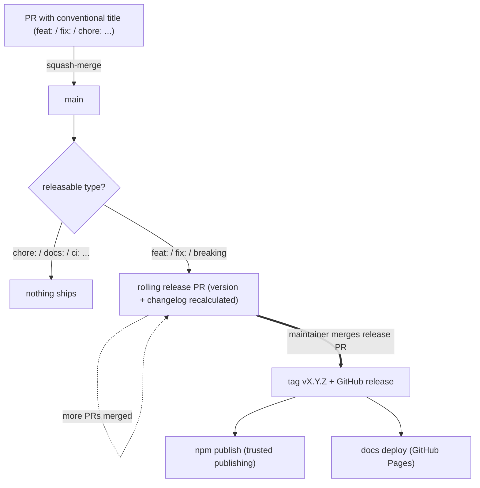

# Contributing

This repository is a fork of the original open-source Mantine DataTable project.
It is maintained to match **our own feature requests and semantics for how a table should behave**, so its scope is intentionally narrower than that of a general-purpose community package — please keep that in mind when proposing changes.

If you find a bug, please feel free to [raise an issue](https://github.com/documatrix/mantine-datatable/issues).
If you have an idea about a new or missing feature, let's discuss it [here](https://github.com/documatrix/mantine-datatable/discussions) before putting significant effort into a PR.

## Things to keep in mind

The repository is holding the code for both Mantine DataTable package and its documentation website.  
Since the repo root contains a `bun.lock` file, it **should be obvious** that you have to use [Bun](https://bun.sh/) to install dependencies and run scripts.  
Use `bun run dev` to start the development server, `bun run lint` to check the code for linting errors, and `bun run build` to check that the code compiles.  
Running `bun run format` will automatically format your code with [Biome](https://biomejs.dev/), so that it adheres to the project’s coding style.  
This is a [Next.js](https://nextjs.org/) project with an [app router](https://nextjs.org/docs/app/building-your-application/routing) and makes use of [React Server Components]().  
**Make sure you have a good grasp of the above before attempting to contribute.**

The Mantine DataTable package code is located in the `package` folder, while the documentation website code is located in the `app` folder.  
The `components` folder holds generic React components used by the documentation website.  
If you want to implement a new feature or improve an existing one, make sure to add an example page and/or alter the one(s) already referring to it.  
It’s not a feature if other people don’t know about it or don’t understand how to use it.

**Please target your PRs to the `main` branch and use [Conventional Commits](https://www.conventionalcommits.org/) in your PR titles** (e.g. `feat: ...`, `fix: ...`).
PRs are squash-merged, so the PR title becomes the commit message on `main` — individual commits inside a PR don't need to follow the convention.

## Release process

Releases are automated with [release-please](https://github.com/googleapis/release-please):

- Every merge to `main` updates a single **rolling release PR** (titled `chore(main): release ...`). It accumulates all releasable changes since the last release and always shows exactly what would ship, as which version, with the generated changelog.
- The proposed version is derived from the accumulated commit types — the highest bump wins:
  - `fix:` → patch (0.1.0 → 0.1.1)
  - `feat:` → minor (0.1.0 → 0.2.0)
  - `feat!:` / `fix!:` or a `BREAKING CHANGE:` footer → major
  - `chore:`, `docs:`, `refactor:`, `ci:`, `test:`, `style:` → no version bump; if only such commits land, no release PR appears at all
- **Merging the release PR is the release.** It bumps `package.json` and `CHANGELOG.md`, tags the commit, creates the GitHub release, publishes the package to npm (via trusted publishing) and deploys the documentation website. Nothing is published before that.
- Release cadence is therefore fully controlled by whoever merges the release PR: merge ten feature PRs and the release PR simply grows; merge it once and all ten ship as one version.
- `main` may be ahead of the latest released version at any time — npm and the docs website always reflect the last merged release PR, not `main`.
- A release always contains *everything* on `main`; partial releases are not possible. If something must not ship yet, don't merge it into `main`.
